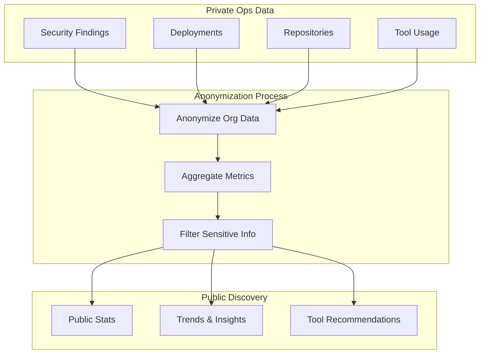

# Public Discovery Design: Ops Findings → Public Insights

## Vision

Transform private ops data (security findings, deployments, tool usage) into public insights that help the VibeOps community make better decisions about tools and practices.

## Core Concept

**Private Ops Data** (org-scoped, private)
↓
**Anonymization & Aggregation**
↓
**Public Insights** (community-visible, valuable)

## Data Flow



## Public Findings Table Design

### Schema

```sql
CREATE TABLE public_findings (
  id UUID PRIMARY KEY DEFAULT gen_random_uuid(),
  
  -- Finding metadata
  finding_type TEXT NOT NULL CHECK (finding_type IN (
    'dependabot_stats',
    'security_trend',
    'tool_effectiveness',
    'deployment_success',
    'performance_benchmark',
    'cost_analysis',
    'compatibility_insight'
  )),
  
  -- Tool context
  tool_stack JSONB NOT NULL, -- Array of tool IDs: ["tool-uuid-1", "tool-uuid-2"]
  tool_categories JSONB, -- Array of category IDs for filtering
  
  -- Anonymized metrics
  anonymized_metrics JSONB NOT NULL, -- {
    -- "avg_security_score": 85,
    -- "vulnerability_count": 12,
    -- "deployment_success_rate": 0.95,
    -- "sample_size": 150
  -- }
  
  -- Human-readable insights
  insights TEXT NOT NULL, -- "Projects using Supabase have 30% fewer security issues"
  confidence_score NUMERIC(3,2) CHECK (confidence_score >= 0 AND confidence_score <= 1),
  
  -- Source tracking (optional, for opt-in orgs)
  opt_in_org_id UUID REFERENCES clients(id), -- NULL = fully anonymized
  source_repo_count INTEGER, -- How many repos contributed to this finding
  
  -- Metadata
  created_at TIMESTAMPTZ NOT NULL DEFAULT now(),
  updated_at TIMESTAMPTZ NOT NULL DEFAULT now(),
  expires_at TIMESTAMPTZ, -- Findings older than X days are archived
  
  -- Moderation
  is_verified BOOLEAN DEFAULT false, -- Admin-verified findings
  is_featured BOOLEAN DEFAULT false -- Featured on homepage
);

-- Indexes
CREATE INDEX idx_public_findings_type ON public_findings(finding_type);
CREATE INDEX idx_public_findings_tool_stack ON public_findings USING GIN(tool_stack);
CREATE INDEX idx_public_findings_created_at ON public_findings(created_at DESC);
CREATE INDEX idx_public_findings_featured ON public_findings(is_featured) WHERE is_featured = true;

-- RLS: Public read, org-scoped write
CREATE POLICY "Public can view findings" ON public_findings
  FOR SELECT USING (true);

CREATE POLICY "Org admins can create findings" ON public_findings
  FOR INSERT WITH CHECK (
    opt_in_org_id IS NULL OR
    is_org_admin(auth.uid(), opt_in_org_id)
  );
```

## Finding Types & Examples

### 1. Dependabot Stats

**Purpose**: Show vulnerability trends by tool stack

**Example**:
```json
{
  "finding_type": "dependabot_stats",
  "tool_stack": ["supabase-uuid", "react-uuid", "typescript-uuid"],
  "anonymized_metrics": {
    "avg_vulnerabilities_per_repo": 3.2,
    "critical_count": 0.1,
    "high_count": 1.2,
    "medium_count": 1.9,
    "resolved_rate": 0.85,
    "sample_size": 45
  },
  "insights": "Projects using Supabase + React + TypeScript average 3.2 vulnerabilities per repo, with 85% resolution rate",
  "confidence_score": 0.92
}
```

**Generation**:
```sql
-- Aggregate security findings by tool stack
WITH tool_stacks AS (
  SELECT 
    r.organization_id,
    ARRAY_AGG(DISTINCT tut.tool_id) as tools_used,
    COUNT(DISTINCT sf.id) as vulnerability_count,
    COUNT(DISTINCT CASE WHEN sf.severity = 'critical' THEN sf.id END) as critical_count
  FROM repositories r
  JOIN tool_usage_tracking tut ON tut.repo_id = r.id
  LEFT JOIN security_findings sf ON sf.project_id::text = r.id::text
  WHERE r.organization_id IN (
    SELECT id FROM clients WHERE allow_public_insights = true
  )
  GROUP BY r.organization_id
)
INSERT INTO public_findings (finding_type, tool_stack, anonymized_metrics, insights, confidence_score)
SELECT 
  'dependabot_stats',
  tools_used,
  jsonb_build_object(
    'avg_vulnerabilities_per_repo', AVG(vulnerability_count),
    'critical_count', AVG(critical_count),
    'sample_size', COUNT(*)
  ),
  'Projects using this tool stack average ' || ROUND(AVG(vulnerability_count), 1) || ' vulnerabilities',
  CASE 
    WHEN COUNT(*) >= 20 THEN 0.9
    WHEN COUNT(*) >= 10 THEN 0.7
    ELSE 0.5
  END
FROM tool_stacks
GROUP BY tools_used
HAVING COUNT(*) >= 5; -- Minimum sample size
```

### 2. Security Trends

**Purpose**: Show security score trends over time by tool

**Example**:
```json
{
  "finding_type": "security_trend",
  "tool_stack": ["supabase-uuid"],
  "anonymized_metrics": {
    "avg_security_score": 87,
    "score_trend": "improving",
    "improvement_rate": 0.15,
    "sample_size": 120,
    "time_period_days": 90
  },
  "insights": "Projects using Supabase show 15% security score improvement over 90 days",
  "confidence_score": 0.88
}
```

### 3. Tool Effectiveness

**Purpose**: Compare tool effectiveness based on real ops data

**Example**:
```json
{
  "finding_type": "tool_effectiveness",
  "tool_stack": ["cursor-uuid", "github-uuid"],
  "anonymized_metrics": {
    "deployment_frequency": 12.5,
    "deployment_success_rate": 0.96,
    "mean_time_to_recovery": 45,
    "change_failure_rate": 0.04,
    "sample_size": 80
  },
  "insights": "Teams using Cursor + GitHub deploy 12.5x per month with 96% success rate",
  "confidence_score": 0.85
}
```

### 4. Deployment Success

**Purpose**: Show deployment patterns by tool stack

**Example**:
```json
{
  "finding_type": "deployment_success",
  "tool_stack": ["fly-io-uuid", "github-uuid"],
  "anonymized_metrics": {
    "success_rate": 0.94,
    "avg_deployment_time_seconds": 180,
    "rollback_rate": 0.06,
    "sample_size": 200
  },
  "insights": "Fly.io + GitHub deployments have 94% success rate with average 3-minute deploy time",
  "confidence_score": 0.91
}
```

### 5. Performance Benchmarks

**Purpose**: Performance metrics by tool combination

**Example**:
```json
{
  "finding_type": "performance_benchmark",
  "tool_stack": ["vite-uuid", "react-uuid"],
  "anonymized_metrics": {
    "avg_build_time_seconds": 45,
    "avg_bundle_size_kb": 250,
    "avg_lighthouse_score": 92,
    "sample_size": 150
  },
  "insights": "Vite + React projects average 45s build time and 92 Lighthouse score",
  "confidence_score": 0.87
}
```

## Anonymization Strategy

### Rules

1. **Minimum Sample Size**: Require at least 5 repos before aggregating
2. **Org Anonymization**: Never reveal which orgs contributed
3. **Metric Rounding**: Round sensitive metrics (e.g., exact counts → ranges)
4. **Opt-in Only**: Only include data from orgs that opt in
5. **Time Windows**: Aggregate over time periods (30/60/90 days) not exact dates

### Implementation

```sql
-- Anonymization function
CREATE OR REPLACE FUNCTION anonymize_ops_metrics(
  org_id UUID,
  metric_type TEXT,
  raw_value NUMERIC
)
RETURNS JSONB AS $$
DECLARE
  anonymized JSONB;
BEGIN
  -- Round to prevent exact org identification
  -- Add noise for privacy
  -- Aggregate with other orgs
  
  RETURN jsonb_build_object(
    'value', ROUND(raw_value, 1),
    'sample_size_range', CASE
      WHEN raw_value < 10 THEN '[1-10]'
      WHEN raw_value < 50 THEN '[10-50]'
      ELSE '[50+]'
    END,
    'anonymized', true
  );
END;
$$ LANGUAGE plpgsql SECURITY DEFINER;
```

## Opt-in Mechanism

### Organization Settings

```sql
-- Add to clients table
ALTER TABLE clients ADD COLUMN allow_public_insights BOOLEAN DEFAULT false;
ALTER TABLE clients ADD COLUMN public_insights_level TEXT DEFAULT 'none' 
  CHECK (public_insights_level IN ('none', 'aggregated', 'detailed'));

-- Levels:
-- 'none': No data shared
-- 'aggregated': Only aggregated metrics (default)
-- 'detailed': More detailed insights (future)
```

### User Consent Flow

1. **Org Admin** enables "Share insights" in org settings
2. **Confirmation dialog**: "This will anonymously share aggregated metrics..."
3. **Opt-in recorded**: `clients.allow_public_insights = true`
4. **Data included**: Future findings include this org's data

## Public API Design

### Endpoints

```typescript
// Get findings by tool
GET /api/public/findings?tool_id=xxx&type=dependabot_stats

// Get tool recommendations
GET /api/public/recommendations?repo_id=xxx

// Get trends
GET /api/public/trends?tool_id=xxx&period=90d

// Get tool effectiveness comparison
GET /api/public/compare?tools=xxx,yyy,zzz
```

### Response Format

```json
{
  "findings": [
    {
      "id": "uuid",
      "type": "dependabot_stats",
      "tool_stack": [
        {"id": "uuid", "name": "Supabase"},
        {"id": "uuid", "name": "React"}
      ],
      "metrics": {
        "avg_vulnerabilities": 3.2,
        "sample_size": 45
      },
      "insights": "Projects using this stack...",
      "confidence": 0.92,
      "created_at": "2026-01-24T10:00:00Z"
    }
  ],
  "meta": {
    "total": 150,
    "page": 1,
    "per_page": 20
  }
}
```

## Frontend Integration

### Public Discovery Pages

**`/findings`** - Browse all public findings
- Filter by tool, category, finding type
- Sort by confidence, recency, sample size
- Show tool stack visualizations

**`/tools/:id/insights`** - Tool-specific insights
- Aggregate findings for this tool
- Show effectiveness metrics
- Compare with similar tools

**`/stacks/:ids`** - Tool stack analysis
- Compare multiple tools together
- Show combined effectiveness
- Recommendations

### Example Component

```tsx
// PublicFindingCard.tsx
export function PublicFindingCard({ finding }: { finding: PublicFinding }) {
  return (
    <Card>
      <CardHeader>
        <div className="flex items-center gap-2">
          <Badge>{finding.finding_type}</Badge>
          <span className="text-sm text-muted-foreground">
            {finding.source_repo_count} repos
          </span>
        </div>
        <CardTitle>{finding.insights}</CardTitle>
      </CardHeader>
      <CardContent>
        <div className="flex gap-4">
          {finding.tool_stack.map(tool => (
            <ToolBadge key={tool.id} tool={tool} />
          ))}
        </div>
        <div className="mt-4">
          <MetricDisplay metrics={finding.anonymized_metrics} />
        </div>
        <div className="mt-2">
          <Progress value={finding.confidence_score * 100} />
          <span className="text-xs text-muted-foreground">
            Confidence: {Math.round(finding.confidence_score * 100)}%
          </span>
        </div>
      </CardContent>
    </Card>
  );
}
```

## Privacy & Compliance

### GDPR Considerations

1. **Opt-in Required**: No data shared without explicit consent
2. **Right to Delete**: Orgs can opt-out and remove their data
3. **Data Minimization**: Only aggregate what's necessary
4. **Anonymization**: No way to identify specific orgs
5. **Transparency**: Clear documentation of what's shared

### Implementation

```sql
-- Opt-out function
CREATE OR REPLACE FUNCTION remove_org_from_public_findings(org_id UUID)
RETURNS void AS $$
BEGIN
  -- Delete findings where this org opted in
  DELETE FROM public_findings 
  WHERE opt_in_org_id = org_id;
  
  -- Recalculate findings without this org's data
  -- (Trigger or scheduled job)
END;
$$ LANGUAGE plpgsql SECURITY DEFINER;
```

## Value Proposition

### For Users
- **Data-driven decisions**: Choose tools based on real ops data
- **Trend awareness**: See what's working in the community
- **Risk assessment**: Understand security implications
- **Cost optimization**: See cost patterns by tool stack

### For Platform
- **Reliable data**: Real usage data, not marketing claims
- **Community value**: Help VibeOps people make better choices
- **Differentiation**: Unique insights not available elsewhere
- **Engagement**: Users contribute data, get insights back

## Implementation Roadmap

### Phase 1: Foundation
- [ ] Create `public_findings` table
- [ ] Add `allow_public_insights` to `clients` table
- [ ] Create anonymization functions
- [ ] Build opt-in UI in org settings

### Phase 2: Data Generation
- [ ] Create aggregation jobs (scheduled)
- [ ] Generate initial findings from existing data
- [ ] Test anonymization quality
- [ ] Verify privacy compliance

### Phase 3: Public API
- [ ] Build public API endpoints
- [ ] Add rate limiting
- [ ] Create API documentation
- [ ] Test with sample queries

### Phase 4: Frontend
- [ ] Build `/findings` page
- [ ] Build tool insights pages
- [ ] Add finding cards to tool detail pages
- [ ] Create stack comparison UI

### Phase 5: Advanced Features
- [ ] AI-generated insights
- [ ] Trend predictions
- [ ] Personalized recommendations
- [ ] Community contributions

## Success Metrics

- **Finding Quality**: Confidence scores > 0.8
- **Sample Sizes**: Average > 20 repos per finding
- **User Engagement**: % of users viewing findings
- **Opt-in Rate**: % of orgs sharing insights
- **Privacy Compliance**: Zero privacy incidents

This design transforms private ops data into valuable public insights while maintaining privacy and compliance.
